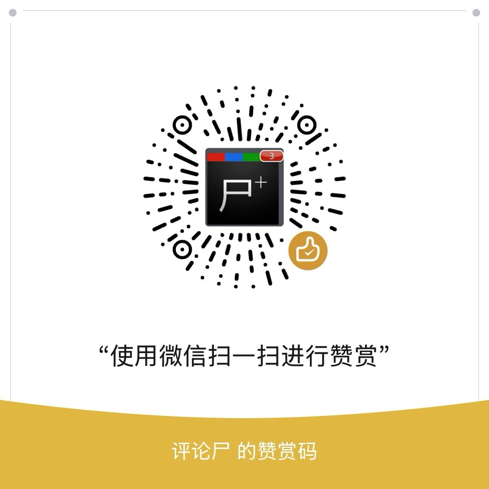

<p align="center">
  
</p>

<h1 align="center">邸报 Dibao</h1>

<p align="center">
  把算法推荐放回你的 RSS 信源里。一个 source-available、fair-code、自托管、个人可控的 RSS 推荐阅读器。
</p>

<p align="center">
  Dibao is source-available, fair-code, and self-hostable under BUSL-1.1.
</p>

<p align="center">
  <a href="./README.md">中文</a> ·
  <a href="./README.ja.md">日本語</a> ·
  <a href="./README.en.md">English</a>
</p>

<p align="center">
  <a href="https://github.com/Pls-1q43/dibao"></a>
  <a href="./compose.yaml"></a>
  <a href="./docs/release-notes-v0.1.0.md"></a>
</p>

---

## 中文

邸报 Dibao 是一个面向个人的 **自托管 RSS 阅读器、RSS 推荐系统、AI RSS reader、OPML 阅读器、PWA 阅读应用**。它不想再造一个内容平台，也不替你决定该订阅什么；你管理 RSS / Atom 信源，邸报只在这些信源内部帮你排序、去重、搜索、解释推荐原因。

如果你每天打开 RSS 都看到几百篇未读，时间线越来越像一堵墙；如果你不想把阅读历史交给广告平台，却又希望有“更懂我”的推荐；如果你希望推荐可以被追问、被调整、被迁移，邸报就是为这种阅读方式准备的。

快速入口：

- [它解决什么问题](#它解决什么问题)
- [你会得到什么](#你会得到什么)
- [支持项目](#支持项目)
- [快速安装](#快速安装)
- [推荐 Provider](#推荐-provider)
- [备份与升级](#备份与升级)
- [许可证](#许可证)
- [常见问题](#常见问题)
- [发布说明](./docs/release-notes-v0.1.0.md)
- [Roadmap](./docs/roadmap.md)

### 它解决什么问题

传统 RSS 把所有文章按时间堆在一起。平台推荐会替你扩大信息来源，也会把阅读数据留在平台里。邸报选择中间路线：

- **信源归你**：只整理你订阅的 RSS / Atom，不引入陌生信息流。
- **排序帮你**：从“最新”里筛出更值得先看的文章，让未读列表更像一张可复核的日报。
- **解释给你**：每篇推荐都能看到原因，例如主题相近、来源稳定、时间新鲜、与你最近的阅读反馈有关。
- **数据留给你**：数据库在你的本地持久化目录、NAS、家用服务器或 VPS 上。
- **失败可恢复**：订阅源抓取失败、provider 不可用、索引需要重建时，界面会给出状态和恢复入口。

### 你会得到什么

| 场景 | 邸报怎么帮你 |
| --- | --- |
| 每天未读太多 | 首页按推荐理由排序，也保留传统 latest 时间线。 |
| 不想错过重要来源 | 订阅源健康诊断会显示失败、停用、长时间未成功的 feed。 |
| 想整理旧订阅 | OPML 导入导出、分组、手动添加 RSS / Atom 地址。 |
| 想稍后再看 | 收藏、稍后读、已读、未读筛选和清账。 |
| 想知道为什么推荐 | 每篇推荐文章都有解释入口，不只是一个黑盒分数。 |
| 想用免费或低成本模型 | 可接入硅基流动、Gemini、Ollama 或其他 OpenAI-compatible embedding provider。 |
| 想在手机上用 | 支持 PWA 安装到主屏幕；离线时能打开应用壳。 |

当前不做：多用户团队协作、官方托管、社交关注、评论转发、平台外内容推荐、云同步、离线全文文章库。

### 支持项目

如果邸报对你有帮助，欢迎使用微信扫码赞赏，支持项目继续维护。

<p align="center">
  
</p>

### 快速安装

推荐用 Docker Compose 运行。把下面内容保存为 `compose.yaml`：

```yaml
name: dibao

services:
  dibao:
    image: ghcr.io/pls-1q43/dibao:v0.1.0
    restart: unless-stopped
    ports:
      - "8080:8080"
    environment:
      DIBAO_HOST: 0.0.0.0
      DIBAO_PORT: "8080"
      DIBAO_DATABASE_PATH: /data/dibao.sqlite
      DIBAO_COOKIE_SECURE: "false"
    volumes:
      - ./data:/data
```

启动：

```bash
docker compose up -d
```

打开 `http://localhost:8080`，创建用户名和密码，然后导入 OPML 或添加第一个 RSS / Atom 地址。

如果你从源码构建当前仓库：

```bash
git clone https://github.com/Pls-1q43/dibao.git
cd dibao
docker compose up --build -d
```

### 推荐 Provider

邸报没有强制绑定任何 AI 服务。你可以先跳过 provider，只用基础排序；也可以接入本地模型、免费额度或免费层的 embedding provider，让推荐更像“按你的兴趣整理过的 RSS”。

怎么选，先看邸报部署在哪里：

| 你的部署方式 | 推荐选择 | 原因与参数 |
| --- | --- | --- |
| 本地 MacBook、Mac mini、Windows 台式机 / 笔记本 | **Ollama 本地模型** | 本地电脑通常比小 VPS 更适合跑 embedding：不花 API 钱，阅读数据不出本机，首次索引慢一点也可以接受。推荐模型：`bge-m3`；Dimension：`1024`。 |
| 家用 NAS 或低功耗小主机 | **优先外部 provider** | 如果 CPU 较弱、内存紧张，embedding 会拖慢设备。建议直接用[硅基流动](https://cloud.siliconflow.cn/i/4wjbYmMH)或 Gemini；如果设备接近桌面级 CPU 且内存充足，再考虑 Ollama。 |
| VPS >= `4 vCPU / 8GB RAM` | **可以用 Ollama CPU** | 可接受后台慢慢生成 embedding 的话，用 `bge-m3`；如果文章很多或机器还跑别的服务，仍建议外部 provider。 |
| VPS < `4 vCPU / 8GB RAM` | **[硅基流动](https://cloud.siliconflow.cn/i/4wjbYmMH)或 Gemini** | 1-2 vCPU、1-4GB RAM 的 VPS 更适合把 embedding 交给 API，避免首次 backfill 和后续刷新挤占服务器资源。 |

本地 Ollama 推荐配置：

```bash
ollama pull bge-m3
```

| 字段 | 填写 |
| --- | --- |
| 类型 | `Ollama` |
| Base URL | Docker Desktop 上通常填 `http://host.docker.internal:11434`；非 Docker 同机运行可填 `http://127.0.0.1:11434` |
| Model | `bge-m3` |
| Dimension | `1024` |

`bge-m3` 是目前更适合邸报默认推荐的本地模型：模型不算大，Ollama 上约 567M 参数，兼顾中文、日文、英文等多语言 RSS；没有必要一开始就上更大的 embedding 模型。只想更轻、更快时，可以把模型换成 `nomic-embed-text`，Dimension 填 `768`。

外部免费 / 低成本 provider 推荐：

| Provider | 适合谁 | 邸报里怎么填 |
| --- | --- | --- |
| [硅基流动 SiliconFlow](https://cloud.siliconflow.cn/i/4wjbYmMH) | 国内访问更方便，支持 OpenAI-compatible API。优先推荐 `BAAI/bge-m3`：免费，没有日额度上限，按 RPM / TPM 限速；当前 L0 级别为 2,000 RPM、500,000 TPM。 | 类型：`OpenAI-compatible`<br>Base URL：`https://api.siliconflow.cn/v1`<br>Model：`BAAI/bge-m3`<br>Dimension：`1024`<br>API Key：硅基流动控制台创建 |
| Gemini | 有 Google AI Studio / Gemini API key，想用 Google 免费层。Gemini embedding 也是免费的，免费层适合日常个人 RSS；按每天约 1,000 次请求规划更稳妥。 | 类型：`OpenAI-compatible`<br>Base URL：`https://generativelanguage.googleapis.com/v1beta/openai/`<br>Model：`gemini-embedding-001`<br>Dimension：`768`<br>API Key：Google AI Studio 创建 |

配置入口：`设置` -> `推荐 provider` -> 选择 `OpenAI-compatible` -> 填入 Base URL、Model、Dimension、API Key -> `测试连接`。

注意：

- 免费额度、免费层、模型价格、限速和可用地区会变化，请以 [Ollama bge-m3](https://ollama.com/library/bge-m3)、[硅基流动模型与文档](https://docs.siliconflow.cn/cn/api-reference/embeddings/create-embeddings) 和 [Gemini API pricing](https://ai.google.dev/gemini-api/docs/pricing) 当前页面为准。
- 更换模型或维度后，需要重新生成 embedding。邸报会保留旧阅读数据，但不同模型的向量不能直接混用。
- Provider 不可用时，邸报仍可阅读 RSS，只是推荐会退回基础排序。

### 日常使用

1. 导入 OPML 或添加 RSS / Atom 地址。
2. 在 `推荐` 看今天优先阅读的文章，在 `最新` 保留传统时间线。
3. 用收藏、稍后读、已读、不感兴趣来调整后续排序。
4. 对未读债务执行清账：全部、24 小时前、7 天前或 30 天前。
5. 在订阅源管理里查看失败源、重试刷新、调整分组或导出 OPML。

清账是阅读命令，不会被当成喜欢或推荐正反馈；收藏和稍后读也不会被清掉。

### PWA 安装

- Android Chrome / Edge：浏览器菜单 -> 安装应用 / 添加到主屏幕。
- iOS Safari：分享 -> 添加到主屏幕。
- Desktop Chrome / Edge：地址栏安装按钮，或浏览器菜单 -> 安装。

`localhost` / `127.0.0.1` 通常可直接安装。局域网 IP 或公网域名建议使用 HTTPS；如果放在 HTTPS 反向代理后，把 `DIBAO_COOKIE_SECURE` 设为 `true`。

### 备份与升级

邸报默认把数据放在 `compose.yaml` 同目录下的持久化文件夹：

```text
./data:/data
./data/dibao.sqlite
```

升级前建议备份：

```bash
docker compose stop
tar czf dibao-data-backup.tgz -C data .
docker compose up -d
```

升级发布镜像时，修改 `compose.yaml` 里的 image tag，然后运行：

```bash
docker compose pull
docker compose up -d
docker compose ps
```

数据库迁移会在启动时自动执行。升级后打开 `http://localhost:8080/api/system/health`，返回 `ok: true` 即表示基础健康检查通过。

### 许可证

Dibao 采用 [Business Source License 1.1](./LICENSE.md)（`BUSL-1.1`）实现 source-available / fair-code / delayed open source 模式。BUSL-1.1 不是 OSI 意义上的开源许可证；每个公开发布版本会在首次公开发布 4 年后的 Change Date 自动变更为 [Apache License 2.0](./LICENSE-APACHE-2.0.md)（`Apache-2.0`）。

个人、家庭、非商业、研究、评估、学习用途，以及公司 / 机构 / 组织内部自托管使用，均可免费使用、修改、自托管和生产使用 Dibao。有偿部署、咨询、培训、迁移和运维支持也被允许，但客户获得的必须是部署在客户自有环境、客户自有账号或客户控制基础设施中的 Dibao 实例。

未经项目维护者单独商业授权，不得提供收费托管、SaaS、Managed Service、Cloud Service、白标、转售、竞争性商业产品，或任何以 Dibao / 修改版 Dibao 为核心能力的商业 RSS 阅读服务、信息流推荐服务、AI 阅读 / 摘要服务、内容聚合平台或知识流产品。商业授权联系：https://dibao.app。具体 Release Date 和 Change Date 以对应 release tag 中冻结的 `LICENSE.md` 为准；`main` 分支只代表当前开发版。中文说明见 [许可证 FAQ](./docs/license-faq.md)。

### 常见问题

**没有 Provider 可以用吗？**

可以。邸报仍然是一个自托管 RSS 阅读器，可以导入 OPML、刷新 feed、阅读、收藏、搜索和清账。Provider 只是让推荐更聪明。

**Provider 测试失败怎么办？**

检查 Base URL、模型名、维度、API Key 是否匹配。硅基流动建议先用免费的 `BAAI/bge-m3` 和 `1024` 维；Gemini 建议先用 `gemini-embedding-001` 和 `768` 维。

**局域网 HTTP 登录后没有保持会话？**

确认 `DIBAO_COOKIE_SECURE=false`。只有 HTTPS 反向代理后才建议设为 `true`。

**Feed 刷新失败怎么办？**

进入订阅源管理查看错误原因。常见原因包括 feed 地址失效、目标站点拒绝访问、XML 格式异常、网络超时。

**邸报会推荐我没订阅的内容吗？**

不会。邸报只在你明确添加的 RSS / Atom 信源中排序和推荐。

<details>
<summary>维护者与开发者信息</summary>

常用环境变量：

| 变量 | 默认值 | 说明 |
| --- | --- | --- |
| `DIBAO_HOST` | `0.0.0.0` | Server 监听地址。 |
| `DIBAO_PORT` | `8080` | Server 监听端口。 |
| `DIBAO_DATABASE_PATH` | `/data/dibao.sqlite` | SQLite 数据库路径。 |
| `DIBAO_COOKIE_SECURE` | `false` | HTTP/LAN 自托管可保持 `false`；HTTPS 反向代理后建议设为 `true`。 |
| `DIBAO_BACKGROUND_JOBS` | `true` | 可设为 `false` 关闭后台 job runner，主要用于测试。 |
| `DIBAO_FETCH_TIMEOUT_MS` | `15000` | RSS、发现、全文抓取的单次请求超时。 |
| `DIBAO_FETCH_FEED_MAX_BYTES` | `5242880` | RSS/发现响应最大读取字节数。 |
| `DIBAO_FETCH_FULL_CONTENT_MAX_BYTES` | `3145728` | 全文抓取响应最大读取字节数。 |
| `DIBAO_AUTH_MAX_FAILED_ATTEMPTS` | `5` | 同一用户名/IP 组合允许的连续登录失败次数；设为 `0` 可关闭限速。 |
| `DIBAO_AUTH_LOCKOUT_MS` | `900000` | 登录失败达到阈值后的冷却时间；设为 `0` 可关闭限速。 |
| `DIBAO_SENTRY_CONFIG` | 未设置 | 可选，指向私有 Sentry 构建配置 JSON。默认读取被忽略的 `config/sentry.json`；示例见 [config/sentry.example.json](./config/sentry.example.json)。 |
| `DIBAO_SENTRY_DSN` | 未设置 | 可选，覆盖私有 Sentry 配置中的 DSN。未设置 DSN 时，遥测开关仍显示，但 Sentry SDK 不会初始化。 |
| `SENTRY_AUTH_TOKEN` | 未设置 | 可选，仅用于前端生产构建上传 source maps。默认不会上传；必须同时设置 `DIBAO_SENTRY_UPLOAD_SOURCEMAPS=1`。 |
| `DIBAO_SENTRY_UPLOAD_SOURCEMAPS` | `0` | 设为 `1` 时，且存在 Sentry org/project/auth token，生产构建才会生成并上传 source maps。 |

开发命令：

```bash
npm install
npm run typecheck
npm test
npm run build
npm run spike:sqlite-vec
npm run dev:server
npm run dev:web
```

E2E smoke：

```bash
npm run e2e:install
npm run e2e
```

推荐链和 Docker 验证：

```bash
npm run perf:recommendation
docker build -t dibao:local .
docker compose config
npm run smoke:docker-recommendation
```

参考文档：

- [工程蓝图](./docs/engineering-blueprint.md)
- [数据库 Schema](./docs/database-schema.md)
- [API Contract](./docs/api-contract.md)
- [Profile Algorithm v0 参数表](./docs/profile-algorithm-v0.md)
- [sqlite-vec Node.js 集成验证](./docs/spikes/sqlite-vec-node.md)
- [Ollama 测试指南](./docs/user-testing-ollama.md)

</details>
