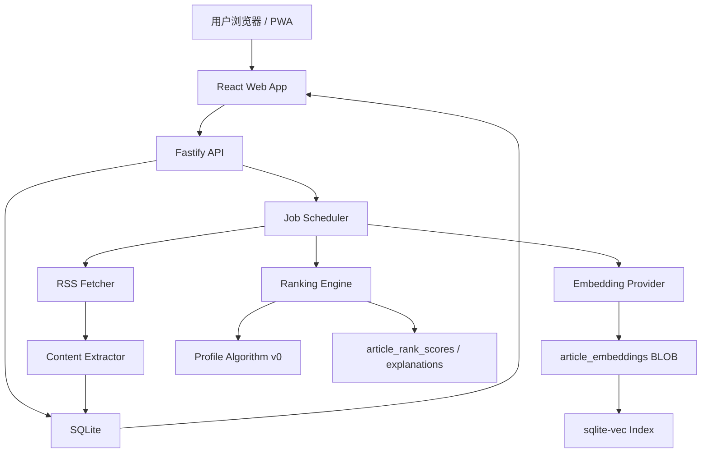

# 邸报 Dibao 工程蓝图

## 文档目的

本文定义邸报 MVP 的工程架构、模块边界、数据模型、任务流、API 轮廓、测试策略和开发里程碑。

它不是最终实现文档，而是第一版开发的技术地图。

## 架构目标

MVP 工程目标：

- 单用户自托管。
- 一个服务提供 API、后台任务和 Web App。
- 默认使用 SQLite + FTS5 + sqlite-vec。
- 前后端使用 TypeScript。
- Web App 从第一天支持移动端和 PWA。
- 推荐系统可解释、可调、可替换。
- embedding provider 可插拔。
- sqlite-vec 被 adapter 隔离，索引可重建。

## 技术栈

```text
语言：TypeScript
运行时：Node.js
后端框架：Fastify
前端框架：React + Vite
组件行为：React Aria Components
样式：CSS Modules + CSS Variables
数据库：SQLite
全文搜索：SQLite FTS5
向量索引：sqlite-vec
部署：Docker
移动端：PWA first, Capacitor later
```

建议包管理和仓库结构：

```text
pnpm workspace
```

## 仓库结构建议

```text
apps/
  server/
    src/
      api/
      jobs/
      modules/
      plugins/
      workers/
  web/
    src/
      app/
      components/
      design-system/
      routes/
      styles/
packages/
  shared/
    src/
      types/
      contracts/
      utils/
  db/
    migrations/
    src/
  ranking/
    src/
  rss/
    src/
docs/
```

说明：

- `apps/server` 提供 Fastify API、静态 Web App 服务和后台任务。
- `apps/web` 是 React / Vite 前端。
- `packages/shared` 放共享类型、API contract 和通用工具。
- `packages/db` 放数据库连接、迁移、repository。
- `packages/ranking` 放推荐排序与画像算法。
- `packages/rss` 放 RSS 解析、正文抽取和去重逻辑。

早期也可以先用更少 package，等模块边界稳定后再拆。

## 系统架构



## 后端模块

### API Server

职责：

- 提供 JSON API。
- 提供单用户认证。
- 提供 Web App 静态资源。
- 暴露健康检查。
- 接收用户行为事件。

### Database Module

职责：

- 管理 SQLite 连接。
- 开启 WAL。
- 执行 migration。
- 初始化 FTS5。
- 初始化 sqlite-vec。
- 提供 repository 层。

### RSS Ingestion Module

职责：

- 抓取 RSS / Atom。
- 支持 ETag / Last-Modified。
- 解析 feed 与 item。
- URL 规范化。
- 文章去重。
- 写入文章元数据。

### Content Extraction Module

职责：

- 从 feed item 中提取摘要和正文。
- 使用 Readability 类策略抽取网页正文。
- 保存原文链接和抽取状态。
- 抽取失败时保留 feed 内容兜底。

### Embedding Module

职责：

- 管理 provider 配置。
- 测试 provider 连通性。
- 对文章生成 embedding。
- 校验维度和模型。
- 写入 `article_embeddings`。
- 通知 VectorStore 更新索引。

Provider 类型：

- embedded_local
- ollama
- openai_compatible
- custom_http

### VectorStore Module

职责：

- 定义统一接口。
- 隔离 sqlite-vec SQL。
- 写入 / 删除 / 查询向量索引。
- 从 BLOB 重建 sqlite-vec 索引。

接口草案：

```ts
export interface VectorStore {
  upsertArticleVector(input: ArticleVectorInput): Promise<void>;
  deleteArticleVector(articleId: string, embeddingIndexId: string): Promise<void>;
  searchSimilarArticles(input: SimilarArticleQuery): Promise<VectorSearchResult[]>;
  rebuildIndex(embeddingIndexId: string): Promise<void>;
}
```

### Ranking Module

职责：

- 计算文章推荐分。
- 生成推荐解释 payload。
- 保存排序结果。
- 在 profile 更新、文章新增、provider 切换后触发重算。

排序输入：

- 文章 embedding
- 正向兴趣簇
- 负向兴趣簇
- 来源权重
- 新鲜度
- 阅读状态
- 重复惩罚
- 用户显式反馈

### Profile Module

职责：

- 接收用户行为事件。
- 将行为转为权重。
- 更新正向 / 负向兴趣簇。
- 对旧簇做时间衰减。
- 清理低权重簇。

### Search Module

职责：

- 管理 FTS5 索引。
- 提供关键词搜索。
- 支持来源、时间、状态筛选。

### OPML Module

职责：

- 导入 OPML。
- 导出 OPML。
- 保留分组结构。
- 对重复 feed 做合并。

### Job Scheduler

职责：

- 定时刷新 feed。
- 调度正文抽取。
- 调度 embedding。
- 调度排序重算。
- 调度旧文章清理。
- 记录 job 状态和错误。

MVP 可以先使用进程内任务调度，不引入 Redis。

## 数据模型草案

### app_settings

```text
key
value_json
updated_at
```

用途：保存全局设置、阅读设置、保留策略等。

### auth

```text
id
password_hash
created_at
updated_at
```

用途：单用户访问保护。

### feed_folders

```text
id
title
sort_order
created_at
updated_at
```

### feeds

```text
id
folder_id
title
site_url
feed_url
description
enabled
etag
last_modified
last_fetched_at
last_success_at
last_error
created_at
updated_at
```

### articles

```text
id
feed_id
guid
url
canonical_url
title
author
summary
published_at
discovered_at
hash
status
created_at
updated_at
```

### article_contents

```text
article_id
content_html
content_text
extraction_status
extraction_error
extracted_at
```

### article_states

```text
article_id
read_at
favorited_at
read_later_at
hidden_at
not_interested_at
reading_progress
updated_at
```

### behavior_events

```text
id
article_id
event_type
event_weight
metadata_json
created_at
```

事件类型：

- impression
- open
- read_progress
- read_complete
- favorite
- read_later
- hide
- not_interested
- mark_read
- mark_unread

### embedding_providers

```text
id
type
name
base_url
model
dimension
api_key_encrypted
enabled
last_test_status
last_test_at
created_at
updated_at
```

### embedding_indexes

```text
id
provider_id
model
dimension
distance_metric
table_name
status
created_at
updated_at
```

### article_embeddings

```text
article_id
embedding_index_id
vector_blob
content_hash
created_at
updated_at
```

这是 embedding 的权威存储。

### sqlite_vec_article_index

sqlite-vec `vec0` 虚拟表。

用途：

- 向量检索索引。
- 可由 `article_embeddings` 重建。
- 不作为唯一数据源。

### interest_clusters

```text
id
embedding_index_id
polarity
label
centroid_vector_blob
weight
sample_count
last_matched_at
created_at
updated_at
```

### feed_stats

```text
feed_id
positive_score
negative_score
open_rate
favorite_rate
last_calculated_at
```

### article_rank_scores

```text
article_id
embedding_index_id
score
interest_score
source_score
freshness_score
diversity_score
penalty_score
calculated_at
```

### article_rank_explanations

```text
article_id
embedding_index_id
payload_json
created_at
```

### jobs

```text
id
type
status
payload_json
error
attempts
run_after
started_at
finished_at
created_at
updated_at
```

## FTS5 设计

建立文章全文索引：

```text
article_fts
- title
- summary
- content_text
```

触发更新时机：

- 新文章写入
- 正文抽取完成
- 文章删除

搜索优先级：

- 标题命中权重最高
- 摘要次之
- 正文再次

## 任务流

### Feed 抓取流

```text
scheduled_feed_refresh
-> fetch feed
-> parse items
-> normalize URL / guid
-> upsert articles
-> enqueue content extraction
-> enqueue embedding for new articles
-> enqueue ranking recalculation
```

### 正文抽取流

```text
content_extraction_job
-> fetch article URL
-> run readability extraction
-> save content
-> update FTS5
-> enqueue embedding if content changed
```

### Embedding 流

```text
embedding_job
-> load article title + summary + content_text slice
-> call active provider
-> validate dimension
-> save vector_blob to article_embeddings
-> upsert sqlite-vec index
-> enqueue ranking recalculation
```

### 行为反馈流

```text
user action
-> write behavior_events
-> update article_states
-> update profile clusters
-> enqueue ranking recalculation
```

### 排序流

```text
ranking_job
-> load candidate articles
-> load embeddings
-> load interest clusters
-> calculate score components
-> save article_rank_scores
-> save article_rank_explanations
```

候选文章范围：

- 未删除
- 未隐藏
- 未过保留期
- 未读优先
- 启用订阅源

## 推荐算法 v0

### 文章候选分

```text
final_score =
  interest_score
+ source_score
+ freshness_score
+ state_score
+ diversity_score
- duplicate_penalty
- negative_interest_penalty
```

### 画像更新

正向行为：

- read_complete
- favorite
- read_later
- long_read

负向行为：

- not_interested
- hide
- quick_bounce

弱信号：

- impression
- open
- short_read

更新规则：

- 找到最相似的同极性兴趣簇。
- 高于阈值则更新 centroid。
- 低于阈值则创建新簇。
- 每种 polarity 设置簇数量上限。
- 定期衰减长期未命中簇。

### 推荐解释

排序时生成 explain payload：

```json
{
  "reasons": [
    { "type": "positive_cluster", "label": "AI 工具", "impact": "positive" },
    { "type": "source", "label": "The Verge", "impact": "positive" },
    { "type": "freshness", "label": "2 小时前", "impact": "positive" },
    { "type": "duplicate", "label": "与 3 篇已读文章主题接近", "impact": "negative" }
  ]
}
```

前端只展示主要原因。

## API 轮廓

### Auth

```text
POST /api/auth/setup
POST /api/auth/login
POST /api/auth/logout
GET  /api/auth/session
```

### Feeds

```text
GET    /api/feeds
POST   /api/feeds
PATCH  /api/feeds/:id
DELETE /api/feeds/:id
POST   /api/feeds/:id/refresh
POST   /api/opml/import
GET    /api/opml/export
```

### Articles

```text
GET   /api/articles
GET   /api/articles/:id
POST  /api/articles/:id/actions
GET   /api/articles/:id/explanation
```

列表参数：

```text
view=recommended|latest|favorites|read_later
feed_id
folder_id
status
limit
cursor
```

### Search

```text
GET /api/search?q=
```

### Settings

```text
GET   /api/settings
PATCH /api/settings
```

### Embedding

```text
GET  /api/embedding/providers
POST /api/embedding/providers
POST /api/embedding/providers/:id/test
POST /api/embedding/indexes/:id/rebuild
```

### Jobs

```text
GET  /api/jobs
POST /api/jobs/:id/retry
```

## 前端架构

### 路由

```text
/setup
/login
/
/latest
/favorites
/read-later
/sources
/sources/:id
/articles/:id
/search
/settings
/settings/embedding
/settings/reader
/settings/system
```

### 设计系统结构

```text
design-system/
  tokens.css
  reader-tokens.css
  Button/
  Dialog/
  Popover/
  BottomSheet/
  Tabs/
  List/
  FeedIcon/
  ArticleItem/
  Reader/
```

设计原则：

- 页面不做营销化 hero。
- 信息密度高但不拥挤。
- 少卡片、少渐变。
- 细边线、清晰层级。
- 阅读设置基于 CSS Variables。

### 状态管理

MVP 可以优先使用：

- React Query 或同类数据请求缓存
- 本地组件状态
- URL 参数承载列表筛选状态

不急于引入复杂全局状态管理。

## 单用户认证

即使是单用户系统，也需要访问保护。

MVP 设计：

- 首次启动创建 owner password。
- 密码使用强 hash 存储。
- 登录后使用 httpOnly session cookie。
- API 默认需要 session。
- 可配置是否允许本地网络访问。

不做：

- 注册
- 多账户
- OAuth
- 组织权限

## 部署方案

MVP 目标部署形态：

```text
Docker image
SQLite database in mounted /data
Web App static assets bundled
Single process with background jobs
```

建议环境变量：

```text
DIBAO_DATA_DIR=/data
DIBAO_HOST=0.0.0.0
DIBAO_PORT=8080
DIBAO_BASE_URL=
DIBAO_LOG_LEVEL=info
```

数据文件：

```text
/data/dibao.sqlite
/data/uploads/
/data/models/
/data/backups/
```

后续可提供：

- `docker run` 示例
- `docker-compose.yml`
- 群晖 Container Manager 部署说明

## 测试策略

### Unit Tests

覆盖：

- RSS URL 规范化
- OPML 解析与导出
- 行为权重计算
- Profile Algorithm v0
- 排序分计算
- provider 配置校验

### Integration Tests

覆盖：

- SQLite migration
- FTS5 写入与查询
- sqlite-vec adapter
- article embedding 写入与索引重建
- feed 抓取到文章入库
- 行为事件到画像更新

### E2E Tests

覆盖：

- 首次设置
- OPML 导入
- 文章阅读
- 收藏 / 稍后读
- 推荐解释
- embedding provider 测试
- 移动端视口阅读流程

## 开发里程碑

### M0 文档与脚手架

- 确认 PRD。
- 确认工程蓝图。
- 初始化 pnpm workspace。
- 初始化 Fastify server。
- 初始化 React / Vite app。
- 配置 lint、format、test。

### M1 数据库与基础服务

- SQLite 连接与 migration。
- 单用户 auth。
- settings。
- feeds / folders / articles schema。
- 基础 API。

### M2 RSS 与 OPML

- OPML 导入 / 导出。
- RSS / Atom 抓取。
- ETag / Last-Modified。
- 文章去重。
- 手动刷新和定时刷新。

### M3 阅读器

- 文章列表。
- 文章阅读页。
- 已读 / 未读。
- 收藏。
- 稍后读。
- 不感兴趣。
- 阅读设置。
- 移动端适配。

### M4 搜索与正文抽取

- Readability 正文抽取。
- FTS5。
- 搜索页。
- 抽取失败状态。

### M5 Embedding 与向量索引

- embedding provider 配置。
- provider 测试。
- article embedding 任务。
- article_embeddings BLOB。
- sqlite-vec adapter。
- 索引重建。

### M6 推荐与解释

- Profile Algorithm v0。
- ranking job。
- article_rank_scores。
- article_rank_explanations。
- 推荐首页。
- 推荐解释 UI。

### M7 PWA 与部署

- PWA manifest。
- 基础 service worker。
- Docker image。
- docker-compose。
- 群晖部署说明草案。
- MVP 回归测试。

## 主要风险

### sqlite-vec 部署兼容性

风险：不同平台加载 extension 失败。

缓解：

- 锁定版本。
- adapter 隔离。
- 提供启动自检。
- 提供索引重建。

### embedding provider 体验不稳定

风险：用户配置外部 provider 失败或模型维度不匹配。

缓解：

- 设置向导测试连接。
- 明确展示模型、维度、错误。
- 未配置 provider 时仍可用基础排序。

### 推荐效果早期不明显

风险：用户行为样本不足时推荐质量普通。

缓解：

- 保留最新时间线。
- 使用来源权重和新鲜度兜底。
- 明确解释“当前学习样本较少”。

### 正文抽取失败

风险：网页结构复杂、反爬、内容缺失。

缓解：

- feed 内容兜底。
- 保留原文链接。
- 标记抽取状态。
- 不把全文抽取作为阅读唯一入口。

### 移动端 PWA 限制

风险：iOS PWA 能力有限。

缓解：

- 核心流程不依赖后台。
- 服务端完成抓取和推荐。
- PWA 主要负责阅读和反馈。

## 开发前仍需细化

- 数据库 migration 具体 SQL。
- Docker 构建策略。
- sqlite-vec Node.js 集成验证。
